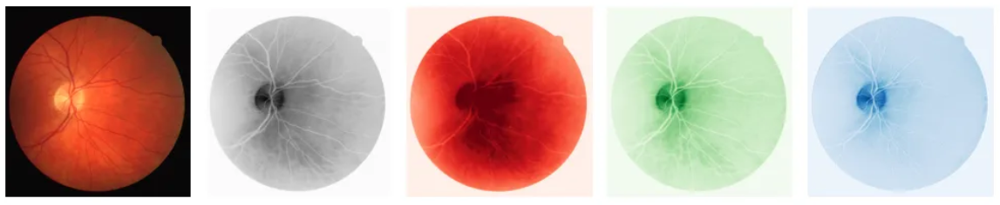
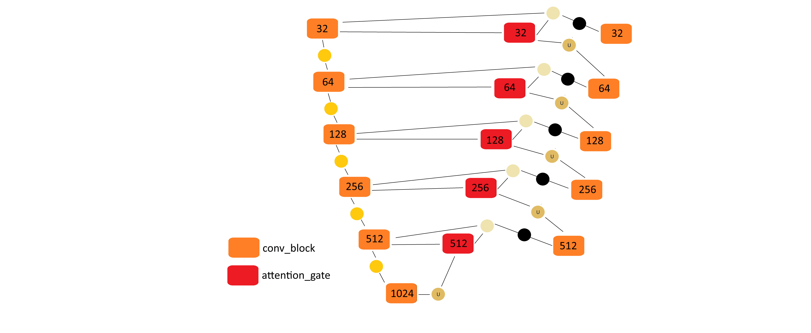
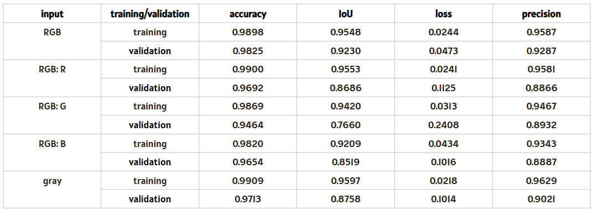
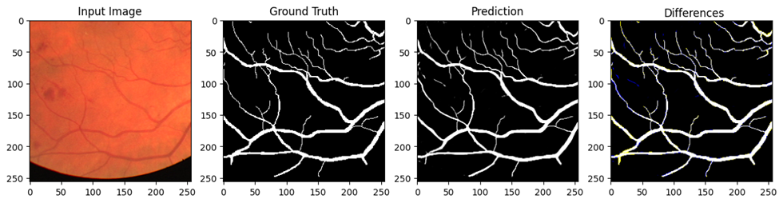

# retinal images segmentation

retinal images segmentation for vessel extraction based on various methods: comparison and improvements

keywords: retinal images, image segmentation, color space models, attention u-net, ALT

The length, width, tortuosity, branching patterns, and angles of retinal blood vessels can be leveraged for diagnosing, screening, treating, and monitoring various cardiovascular and ophthalmologic conditions, including diabetes, hypertension, arteriosclerosis, and choroidal neovascularization.

Challenges depending on the area of an image:
- blurry region
- poor contrast
- varying illumination
- noise
- good contrast for thick vessels but low contrast for the tiny vessels
- pathological conflict with the blood vessels & varying contrast

Methods:
1. ALT methods
2. Attention U-Net

Data:
1. RGB images
2. Grayscale images
3. R channel of RGB images
4. G channel of RGB images
5. B channel of RGB images

Visual representation of a differences between different inputs used within the study

Augmentation:
- geometric transformations
- cropping

Attention U-Net:

Schematic representation of Attention U-Net architecture

input shape: 256x256xDEPTH

where:
- DEPTH = 3 for RGB images
- DEPTH = 1 for R,G,B and grayscale images

Achieved results:

Training and validation results for attention U-net

Comparison of predicted segmentation with ground truth for one of the RGB images from the test set (mean DICE value for test set = 0.91)

Further steps:
- in depth analysis comparing achieved results
- further analysis of avaliable accuracy metrics and loss functions used in segmentation of small objects
- search for new methods to verify the accuracy of the results of the segmentation of small objects
